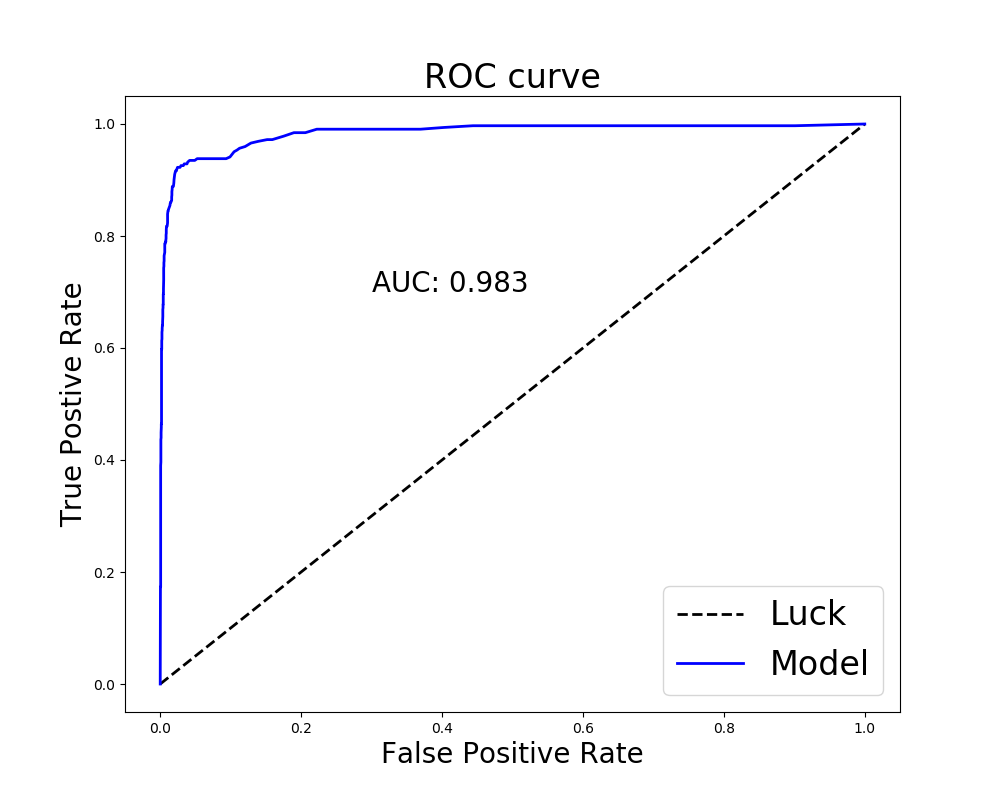

# Fraud Case Study
As the world is getting more dependent on electronic forms of payment, unfortunately the rate of fraudulent charges are increasing as well. Fraudlent charges cost money and time and result in frustration for both the company and the consumer. With a model our team built, we are able to predict with very high accuracy whether an incoming charge will be fradulent or not based on many factors, so we can prevent the fraudulent transfer of funds before the transaction takes place.

## Data and Cleaning
Numerous features were dropped for various reasons.  
Assumed not to have significant relevance to Fraud and/or would have to be one hot encoded into too many columns:  
Venue State,Venue name, Has_header, sale_duration, sale_duration2, Venue_latitude, Venue longitude, Venue address*, name_length*, name, object_id, listed, num_payouts* (maybe tfidf, org_desc, ticket_types

* Asterisk indicates feature may be reconsidered in the future

Unclear what data represents and no clear distinction in target value:
gts, approx_payout_date, user_created

Feature Engineering: 
User Age - Changed to binary - 0 or not  
event_end, event_start, event_published, event_created - Changed into event length  
Email Domain - Used as country code  
Org Name - Converted to binary : Whether it had an organization name or not  
Payee name - Whether a name is specified or not  
User type - converted to binary, whether 1 or not (highly correlated with fraud)  
Venue country, country - Converted to binary, whether the same or not

## Text Processing Pipeline

## EDA

Feature usefullness? Why drop?
Plots of features? I will put that

## Results

Used random forest model because...
(Provide link to app when ready)

Deploying flask-
    Got AWS Instance created, 
    Docker image built 
        - having truoble with dockerfile and getting app to run through docker/AWS, 
        - example file doesn't seem to work, keeps timing out, don't understand register URL
    
# {'classifier__n_estimators': 368, 'classifier__min_samples_split': 2, 'classifier__min_samples_leaf': 1, 'classifier__max_features': 'sqrt', 'classifier__max_depth': None, 'classifier__bootstrap': False}
# len(df['previous_payouts'][1]) == 0
# no previous payouts, suspicious

# user age = 0 or <100
#some outliers with 800+

# user type
# 70% fraud events user type =1
# 25% all events user type =1

{'classifier__n_estimators': 368, 'classifier__min_samples_split': 2, 'classifier__min_samples_leaf': 1,
    'classifier__max_features': 'sqrt', 'classifier__max_depth': None, 'classifier__bootstrap': False}

#TODO

        predict.py 
            loads model, loads example(example.json), runs example through feature engineering pipeline,
            adds columns from original training data to match the structure,gets probability of fraud,
            makes prediction based on a specified threshold
        
        for each example calculate the probability of fraud and add to database along with event info
        
        '''
    #WEB APP
    '''
        
        Set up a route POST /score and have it execute the logic in your prediction script. 
        You should import the script as a module and call functions defined therein. (predict.py)
    There are two things we'll do to make this all more efficient:

We only want to unpickle the model once
We only want to connect to the database once.
    '''

Sources:
https://www.veridiancu.org/news/advice/fraud-101-credit-debit-security